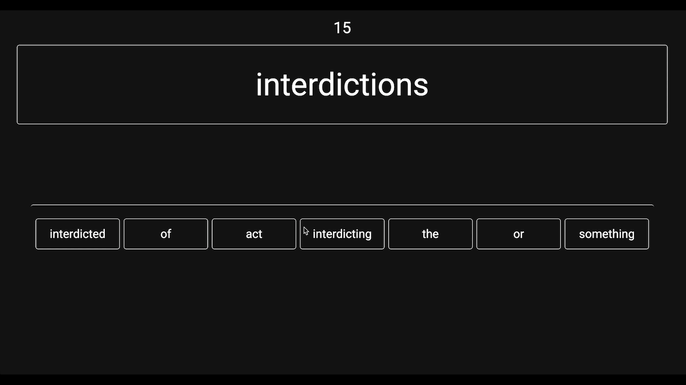
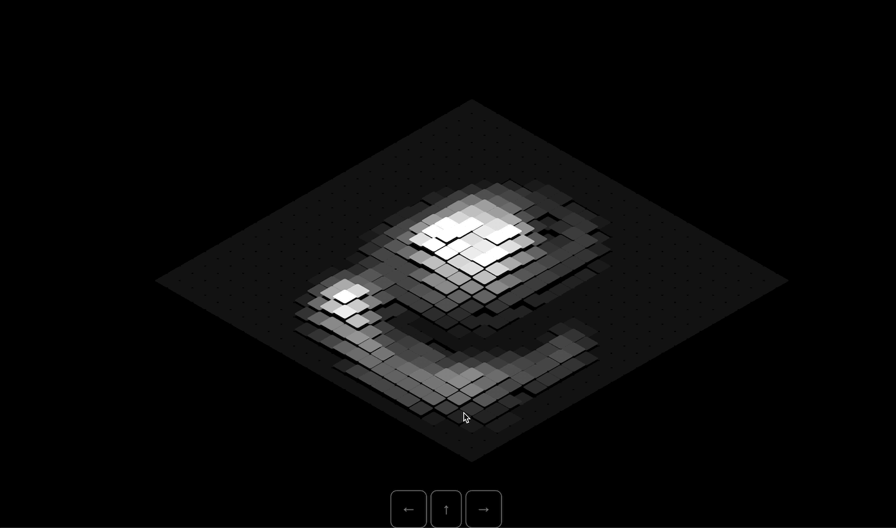

# web-projects
A list of small web projects I made in my free time!

## 📕[Definition Game](https://myjeandev.github.io/web-projects/websites/definition-game/index.html)  

    

A game about sorting the dictionary definition of a random word. This project uses API calls to free API services that do no require a key to access them.

## ⛰️[Landscape Painting](https://myjeandev.github.io/web-projects/websites/topography-painting/index.html)  

    

A visual experiment where I use the CSS 3D transform attribute to create an interactive topographical map. I store data on each square in a 2D array grid, as you click you can increase the height of the squares, you can use the arrow keys to move around and you'll notice the map updates with where you are.

## 🐱[imprtraits](https://myjeandev.github.io/web-projects/websites/imprtraits/default.html)  

    

A static webpage where I experimented with using pngs with transparent backgrounds to create a sketch like style on a paper textured background. Also includes an interactive scroll tracker.

## 🌊[Wave Simulation](https://myjeandev.github.io/web-projects/websites/wave-simulation/index.html)  

    

Simple interactive wave simulation visual using javascript
